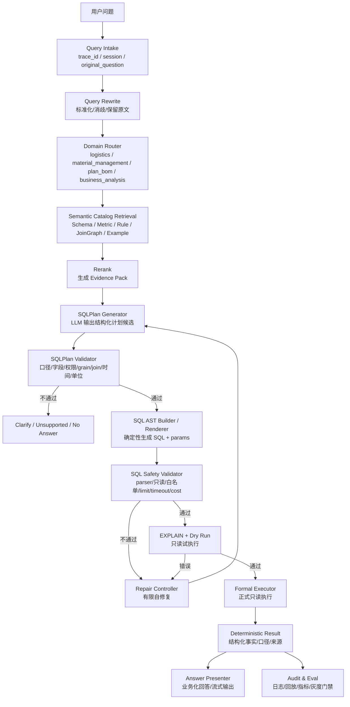

# gcl-bp-ai NL2SQL 架构改造规划

> **For Hermes:** 当前为规划交付，不实施代码。后续若执行，请按 TDD + shadow-only + review + 验收材料推进。

**目标：** 在不破坏现有物流、计划 BOM、功率预测和物管中间库建设边界的前提下，把自然语言问数链路逐步升级为“NL → 结构化查询计划 → 受控 SQL/服务执行 → 业务化回答”的可审计架构。

**核心结论：** 不建议把 NL2SQL 理解为“LLM 直接生成任意 SQL 并执行”。gcl-bp-ai 更适合采用 **受控 NL2SQL**：LLM 主要生成结构化 `SQLPlan/QueryPlan` 候选，后端基于语义目录、指标口径、join graph、权限、安全校验和 SQL AST/Renderer 生成只读 SQL；必要时允许 LLM 辅助修复，但所有修复仍必须重新校验和试执行。

---

## 0. 当前仓库状态判断

### 0.1 已完成/可复用能力

基于当前仓库只读审查，已有基础包括：

1. **Query Planning V2 统一框架已存在**
   - `backend/app/domains/query_planning/schemas/query_plan_v2.py`
   - `backend/app/domains/query_planning/services/query_planning_v2_service.py`
   - `backend/app/domains/query_planning/services/strategy_router.py`
   - `backend/app/domains/query_planning/services/query_plan_v2_audit_writer.py`
   - `backend/app/domains/query_planning/services/shadow_snapshot_builder.py`
   - `backend/app/domains/query_planning/services/shadow_report_service.py`
   - `backend/app/domains/query_planning/services/response_meta_exposure_service.py`

2. **物流 LLM Query Planner V2 MVP 已有目录和组件**
   - `backend/app/domains/logistics/services/query_planner_v2/planner.py`
   - `prompt_builder.py`
   - `llm_parser.py`
   - `normalizer.py`
   - `validator.py`
   - `capability_registry.py`
   - `legacy_adapter.py`
   - `fallback.py`

3. **物流现有链路具备受控执行基础**
   - 规则 planner、query_key 白名单、repository 参数绑定、answer presentation、guardrail、query log 都可复用。

4. **Plan BOM 已有 NLU/QA 链路，但仍偏领域专用**
   - `PlanBomNluCenterService`、`PlanBomQaService` 可作为后续 domain adapter 数据来源。

5. **物管域目前还是新建设计阶段**
   - `backend/app/domains/material_management/` 当前只有基础目录，后续 NL2SQL 不应直接查 SAP Oracle MID，只能查同步后的智能助手中间库。

### 0.2 当前未完成能力

1. 没有正式跨域 NL2SQL 执行引擎。
2. 没有统一语义目录中心：表、字段、指标、口径、join graph、grain、权限、示例尚未形成版本化 catalog。
3. 没有 Schema / Metric / Rule / Example 的统一召回与 rerank 服务。
4. 没有 `SQLPlan` / SQL AST 级别的 schema、validator、renderer。
5. 没有 SQL 安全校验、EXPLAIN、试执行、自修复闭环。
6. 没有 NL2SQL 的离线评估集、线上 shadow 对比报表、准确率/安全率门槛。
7. Material Management 还没有实际中间库查询服务，因此不应先让它进入自动 SQL 执行。

### 0.3 本次规划与当前仓库是否一致

一致，但要分阶段：

- 当前仓库已有 Query Planning V2 和物流 Query Planner V2 雏形，适合作为 NL2SQL 的上游规划层。
- 当前需求文档多次强调“不让 LLM 自由生成 SQL 并执行”，所以 NL2SQL 改造必须设计成 **后端受控 SQL 生成**，而非自由 SQL。
- 物管域当前 M2 仍要求基于中间库和 SQL 模板，不允许实时直查 Oracle MID；NL2SQL 也必须遵守这一点。

### 0.4 本轮允许/禁止范围

本轮只做规划，不改业务代码。

后续实施时允许：

- 在 `backend/app/domains/query_planning/` 扩展跨域 NL2SQL 公共组件。
- 在各业务域建立语义 catalog 和 adapter。
- 先 shadow 记录，不改变正式答案。
- 只查智能助手中间库，不直查 SAP Oracle MID。

后续实施时禁止：

- 让 LLM 自由 SQL 直接查库。
- 绕过 query_key / metric / table / column / permission 白名单。
- 用 NL2SQL 替换现有主链路后不跑全量回归。
- 在用户可见回答中暴露 SQL、表名、字段名、planner、guardrail、debug 等技术细节。
- 新增临时 token/admin header 作为诊断权限。

---

## 1. 对你给出的 12 步流程的修正版

你的流程方向是对的。我建议把它拆成“理解层、语义检索层、计划层、SQL 安全执行层、表达与评估层”五大层，并在 SQL 生成前插入 **结构化 SQLPlan** 作为强约束。

```text
用户问题
↓
0. Request Intake / Trace / 会话上下文收束
↓
1. Query Rewrite / 口语标准化，但必须保留 original_question
↓
2. Domain Router / Source Router，识别物流、物管、计划 BOM、经营分析及可用数据源
↓
3. Semantic Catalog Recall：召回 Schema / Metric / Rule / Join Graph / Example / Synonym
↓
4. Rerank + Evidence Pack：精排并形成可引用证据包
↓
5. SQLPlan 生成：LLM 生成结构化计划候选，不直接执行 SQL
↓
6. SQLPlan Validator：后端校验指标、字段、grain、join、权限、时间、单位、B/C 边界
↓
7. SQL AST / SQL 生成：优先由确定性 renderer 从 SQLPlan 生成 SQL
↓
8. SQL Safety Validator：SQL parser + 白名单 + 只读 + 参数绑定 + limit/timeout/cost
↓
9. EXPLAIN / Dry Run / 试执行：只读事务、限行、超时、结果形态检查
↓
10. SQL 自修复：最多 N 轮，基于错误类型修复，不能放宽业务约束
↓
11. 正式执行：只读账号 + 受控连接 + 审计 + 结果结构化
↓
12. 结果解释：后端事实为准，LLM 只做业务化表达
↓
13. 查询日志、评估、回放、灰度门禁
```

> 关键变化：把你的第 5 步“SQL Plan 生成”和第 6 步“SQL 生成”强制分离，并规定 **SQLPlan 是正式契约，SQL 是 renderer 产物**。这样能兼顾 NL2SQL 泛化能力和业务安全。

---

## 2. 推荐目标架构



---

## 3. 核心模块设计

### 3.1 Query Intake

职责：

1. 生成 `trace_id`。
2. 保留 `original_question`。
3. 收束会话上下文，只允许引用明确的上文结果 ID 或用户显式指代。
4. 设置请求级开关：`shadow_only`、`include_meta`、`domain_hint`、`dry_run_only`。

输出建议：

```json
{
  "trace_id": "...",
  "original_question": "2025年合肥至马鞍山17.5米车平均运费是多少？",
  "domain_hint": null,
  "session_refs": [],
  "shadow_only": true
}
```

### 3.2 Query Rewrite

职责：

1. 口语标准化：`17米五` → `17.5米`，`23年` → `2023年`。
2. 同义表达标准化：`发/至/到/往/运到` → 路线语义。
3. 不得丢失约束：时间、地点、客户、供应商、订单、单位、目标功率等不能被省略。
4. 不得覆盖原始问题：`original_question` 永远保留，`rewritten_question` 只作为辅助。

建议输出：

```json
{
  "original_question": "2025年合肥至马鞍山17米五车均费",
  "rewritten_question": "查询2025年合肥到马鞍山17.5米车的平均运费",
  "rewrite_confidence": 0.92,
  "preserved_constraints": ["2025", "合肥", "马鞍山", "17.5米", "平均运费"]
}
```

### 3.3 Domain Router / Source Router

领域建议：

1. `logistics`：物流历史台账、2026 系统物流数据。
2. `material_management`：库存、出入库、采购执行、工单组件，只查智能助手中间库。
3. `plan_bom`：计划 BOM、功率预测、BOM 配置与物料结构。
4. `business_analysis`：后续经营分析。
5. `unknown`：无法判定时澄清。

Source Router 需要区分：

- `middle_db_logistics_history`
- `middle_db_logistics_2026`
- `middle_db_material_management`
- `middle_db_plan_bom_excel`
- `middle_db_plan_bom_sap`

明确禁止：

- 用户问答实时直接查 `SAP Oracle MID`。
- 多源混查时静默混合，例如 2023–2025 历史台账与 2026 系统数据必须拆分或澄清。

### 3.4 Semantic Catalog

这是 NL2SQL 成败的中心。建议做成版本化 catalog，而不是散落在 prompt 里。

建议目录：

```text
backend/app/domains/query_planning/semantic_catalog/
  schemas.py
  loader.py
  validator.py
  retriever.py
  reranker.py

backend/app/domains/logistics/config/semantic_catalog/
  tables.yaml
  metrics.yaml
  dimensions.yaml
  joins.yaml
  rules.yaml
  examples.yaml
  synonyms.yaml

backend/app/domains/material_management/config/semantic_catalog/
  tables.yaml
  metrics.yaml
  dimensions.yaml
  joins.yaml
  rules.yaml
  examples.yaml
  synonyms.yaml

backend/app/domains/plan_bom/config/semantic_catalog/
  tables.yaml
  metrics.yaml
  dimensions.yaml
  joins.yaml
  rules.yaml
  examples.yaml
  synonyms.yaml
```

每个 catalog 至少声明：

1. 表：物理表名、业务表名、描述、所属领域、grain、时间字段、主键、可用状态。
2. 字段：字段名、业务名、同义词、类型、是否可过滤/聚合/分组/排序、脱敏规则。
3. 指标：公式、聚合方式、单位、口径说明、适用 grain、适用 source。
4. 维度：可 group by 字段、层级关系、枚举/实体解析。
5. Join Graph：允许的 join 边、join key、基数、join 类型、是否会放大行数。
6. 规则：默认时间范围、空结果处理、业务边界、B/C 禁止项。
7. 示例：自然语言问题、SQLPlan、预期 SQL 模板或预期结果形态。

指标示例：

```yaml
metric_key: logistics_avg_fee
business_name: 平均运费
formula: SUM(total_fee) / NULLIF(SUM(shipment_trip_count), 0)
unit: 元/车
allowed_domains: [logistics]
allowed_sources: [middle_db_logistics_history]
required_fields: [total_fee, shipment_trip_count]
default_aggregation: weighted_avg
business_rule: 运费均价按总费用 / 车次数，不使用明细行 AVG(total_fee)
```

### 3.5 Schema / Metric / Rule / Example 召回

召回不建议只做向量。应混合：

1. **Hard filter**：先按 domain、source、query type 过滤。
2. **Keyword/BM25**：字段名、业务词、同义词匹配。
3. **Embedding**：自然语言描述和示例语义召回。
4. **Entity linking**：订单号、客户、供应商、城市、物料编码先确定候选实体。
5. **Capability filter**：只召回当前领域已上线/可 shadow 的能力。

召回结果进入 Evidence Pack：

```json
{
  "domain": "logistics",
  "tables": [...],
  "metrics": [...],
  "dimensions": [...],
  "join_edges": [...],
  "rules": [...],
  "examples": [...]
}
```

### 3.6 Rerank 精排

Rerank 的目标不是直接选 SQL，而是选“足够支撑 SQLPlan 的证据”。

精排维度：

1. domain/source 一致性。
2. 指标口径匹配度。
3. 时间范围匹配度。
4. 表 grain 是否适合问题。
5. join 是否最短、是否避免行数膨胀。
6. 示例与问题结构相似度。
7. B/C 风险，例如预测、未支持单位、跨源混查。

输出：

```json
{
  "evidence_pack_id": "...",
  "selected_metrics": ["logistics_avg_fee"],
  "selected_tables": ["dws_logistics_detail_union"],
  "selected_rules": ["avg_fee_weighted_by_trip_count"],
  "selected_examples": ["route_avg_fee_example_001"],
  "risk_flags": []
}
```

### 3.7 SQLPlan 生成

SQLPlan 是 NL2SQL 的核心契约。建议新建跨域 schema，而不是直接让 LLM 输出 SQL。

建议文件：

```text
backend/app/domains/query_planning/schemas/nl2sql_plan.py
```

建议结构：

```python
class SqlPlan(BaseModel):
    schema_version: str
    domain: str
    source: str
    original_question: str
    rewritten_question: str | None
    intent: str | None
    strategy: Literal["SQL_DIRECT", "CLARIFY", "UNSUPPORTED", "NO_ANSWER", "DECOMPOSE"]
    tables: list[SqlPlanTable]
    joins: list[SqlPlanJoin]
    metrics: list[SqlPlanMetric]
    dimensions: list[SqlPlanDimension]
    filters: list[SqlPlanFilter]
    group_by: list[str]
    order_by: list[SqlPlanOrder]
    limit: int | None
    having: list[SqlPlanHaving]
    post_processing: list[SqlPlanPostProcess]
    params: dict[str, Any]
    evidence_ids: list[str]
    confidence: float
    clarification_questions: list[str]
    unsupported_reason: str | None
```

原则：

- LLM 可以生成 `SqlPlan` 候选。
- LLM 不生成最终 SQL，或即使生成 draft SQL 也只作为调试参考，不参与执行。
- 后端 validator 才决定计划是否可执行。

### 3.8 SQLPlan Validator

必须确定性校验：

1. domain/source 是否允许。
2. tables 是否在 catalog 白名单。
3. columns 是否属于 selected tables。
4. metrics 是否在 metric catalog，公式是否可展开。
5. filters 是否允许、类型是否正确、枚举/实体是否可解析。
6. group_by 是否与指标 grain 兼容。
7. joins 是否只使用 join graph 白名单边。
8. 是否出现行数膨胀风险。
9. 时间范围是否符合数据源边界。
10. 单位是否支持。
11. B/C 边界是否被误放行。
12. limit 是否存在且不超过上限。
13. 是否含 SQL 片段、代码、表名猜测、answer/computed_value 等危险字段。

失败结果只能进入：

- `CLARIFY`
- `UNSUPPORTED`
- `NO_ANSWER`
- `fallback_to_legacy`
- `shadow_only_blocked`

### 3.9 SQL AST / SQL Renderer

SQL 生成建议由后端 renderer 完成：

```text
SqlPlan
↓
SqlAst
↓
DialectRenderer(Postgres/MySQL/SQLite/Oracle-middle-db)
↓
ParameterizedSql(sql, params)
```

设计要求：

1. 只生成 `SELECT` 或 `WITH ... SELECT`。
2. 所有条件参数化，不拼接用户原文。
3. 自动添加 `LIMIT`。
4. 自动添加数据权限/source filter。
5. 自动添加必要时间范围，缺失则按业务默认或澄清。
6. 复杂指标由 metric catalog 展开，不能让 LLM 写公式。

### 3.10 SQL Safety Validator

SQL 生成后还要二次校验。

建议使用 SQL parser，例如 `sqlglot`，校验：

1. 只读：只允许 `SELECT` / `WITH SELECT`。
2. 禁止：`INSERT`、`UPDATE`、`DELETE`、`DROP`、`ALTER`、`TRUNCATE`、`CREATE`、`MERGE`、`CALL`、`COPY`。
3. 禁止多语句、分号注入、注释绕过。
4. 表、字段、函数都在白名单。
5. 无 `SELECT *`。
6. 无无限制大表扫描，必须有 limit 或聚合约束。
7. 禁止危险函数和系统表。
8. 参数必须完整绑定。
9. SQL 与 SqlPlan 一致：不能多查表、少过滤、改指标。

### 3.11 EXPLAIN / 试执行

正式执行前先做：

1. `EXPLAIN` 或等价 dry run。
2. 只读事务。
3. 小 limit 试执行，例如 `LIMIT 20`。
4. 超时控制。
5. 结果形态检查：列名、类型、行数、空结果、异常大数。
6. 成本检查：超过阈值则拒绝或降级。

试执行不能改变正式结果，只用于安全和修复。

### 3.12 SQL 自修复

自修复必须有边界：

1. 最多 2 轮。
2. 只能基于结构化错误修复：字段不存在、类型不匹配、需要 group_by、参数类型错误、join alias 错误。
3. 不能放宽权限。
4. 不能删除用户显式过滤条件。
5. 不能把 unsupported 单位替换成近似指标。
6. 不能跨 domain/source 改查。
7. 每次修复后重新走 SQLPlan Validator、SQL Safety Validator、EXPLAIN。

修复失败：返回业务化澄清/不支持，不向用户暴露 SQL 错误。

### 3.13 正式执行

执行器要求：

1. 只读数据库账号。
2. statement timeout。
3. max rows / max bytes。
4. 参数绑定。
5. trace_id 注入日志。
6. 对大结果默认汇总，明细需二次确认或导出流程。
7. 执行结果返回结构化 facts，不直接交给 LLM 自由解释。

### 3.14 结果解释

沿用现有 answer presentation 原则：

1. 后端确定性结果是唯一事实来源。
2. LLM 只做业务化表达和结构化展示建议。
3. 用户可见回答不暴露 SQL、字段名、表名、planner、guardrail、debug、raw payload。
4. 流式输出可以展示业务阶段：理解问题、确认口径、查询数据、组织回答。
5. 对空结果、澄清、不支持、异常必须保持状态，不可被 LLM 改成成功。

---

## 4. 分阶段实施路线

### Phase 0：NL2SQL 现状审计与设计冻结

交付：

1. 当前 Query Planning V2 / 物流 Query Planner V2 / Plan BOM NLU / 物管设计审计。
2. NL2SQL 总体设计文档。
3. 安全边界确认：是否允许生产使用 SQL renderer；是否允许 LLM 只输出 SQLPlan。

不做：

- 不改主链路。
- 不执行 LLM 生成 SQL。

### Phase 1：Semantic Catalog MVP

范围：物流 P0 + 物管首批库存/出入库预留。

交付：

1. catalog schema。
2. 物流表/字段/指标/规则/示例 catalog。
3. `logistics_avg_fee` 等核心指标口径固化。
4. catalog validator。
5. 单测：字段白名单、指标公式、join graph、grain 校验。

### Phase 2：召回 + Rerank + Evidence Pack

交付：

1. Schema/Metric/Rule/Example 混合召回。
2. Rerank service。
3. Evidence Pack schema。
4. 离线测试：给定问题必须召回正确指标、表和示例。

### Phase 3：SqlPlan schema + Validator

交付：

1. `SqlPlan` / `SqlPlanValidationResult`。
2. SQLPlan Generator fake-client 测试。
3. Validator 拦截非法表、字段、指标、join、时间、单位、B/C 边界。
4. 先 shadow，不生成正式 SQL。

### Phase 4：SQL AST Renderer + Safety Validator

交付：

1. SqlPlan → SqlAst → parameterized SQL。
2. SQL parser safety validator。
3. 参数绑定和 limit/timeout。
4. 单测覆盖 SQL 注入、DDL/DML、多语句、select *、非白名单表字段。

### Phase 5：EXPLAIN / Dry Run / Repair Controller

交付：

1. EXPLAIN service。
2. dry run executor。
3. repair controller，最多 2 轮。
4. 错误分类和修复日志。
5. 修复后全链路重校验。

### Phase 6：物流 shadow 集成

范围：先选 2–3 个 query_key：

1. `hist_route_pricing_analysis`
2. 城市/承运商费用 TOP
3. 月度趋势/年度对比

交付：

1. 正式答案仍走旧链路。
2. 旁路生成 SqlPlan + SQL + dry run 结果。
3. 写入 `sys_query_log.request_payload.nl2sql_shadow`。
4. 灰度报表展示：plan 命中、SQL 有效、安全拦截、试执行成功、结果一致性。

### Phase 7：物流 P0 controlled assist

开启条件：

1. shadow 覆盖率 ≥ 95%。
2. query_key / metric / slot 一致率 ≥ 98%。
3. SQL safety 拦截异常为 0 未处理。
4. B/C 误放行为 0。
5. dry run 失败率低于阈值。
6. 全量物流回归通过。

执行：

- 只对 `hist_route_pricing_analysis` 开启 assist。
- 旧 planner 仍保留一键回滚。
- 出现任何安全/口径问题立即回 shadow。

### Phase 8：物管域接入

前提：

1. 物管首批中间库表已落地。
2. 不直接查 SAP Oracle MID。
3. 库存/出入库查询服务和 SQL 模板已稳定。

先 shadow 的问题类型：

1. 当前库存。
2. 物料出入库流水。
3. 库存为零/短缺。
4. 按工厂/库位/物料聚合。

### Phase 9：Plan BOM 接入

建议晚于物流和物管，因为 BOM 的实体消歧更复杂。

重点：

1. 订单号、BOM 文件名、客户实例、版本必须由 repository 确认。
2. LLM 只能抽槽，不能判断 BOM 事实。
3. 功率预测继续由确定性引擎计算，不进入 SQL 自由计算。

### Phase 10：评估平台和运营闭环

交付：

1. Golden set：每个 domain 至少 100–300 条。
2. 日志回放：按 trace_id 重跑 planner 和 SQL safety。
3. 指标看板：准确率、安全率、fallback 率、延迟、成本、修复率。
4. 人工标注和反馈闭环。

---

## 5. 建议新增/修改文件清单

### 5.1 公共 NL2SQL 模块

```text
backend/app/domains/query_planning/schemas/nl2sql_plan.py
backend/app/domains/query_planning/schemas/semantic_catalog.py
backend/app/domains/query_planning/services/query_rewrite_service.py
backend/app/domains/query_planning/services/domain_source_router.py
backend/app/domains/query_planning/services/semantic_catalog_loader.py
backend/app/domains/query_planning/services/semantic_retriever.py
backend/app/domains/query_planning/services/semantic_reranker.py
backend/app/domains/query_planning/services/sql_plan_generator.py
backend/app/domains/query_planning/services/sql_plan_validator.py
backend/app/domains/query_planning/services/sql_ast_builder.py
backend/app/domains/query_planning/services/sql_renderer.py
backend/app/domains/query_planning/services/sql_safety_validator.py
backend/app/domains/query_planning/services/sql_explain_service.py
backend/app/domains/query_planning/services/sql_repair_service.py
backend/app/domains/query_planning/services/nl2sql_shadow_service.py
backend/app/domains/query_planning/services/nl2sql_eval_log_service.py
```

### 5.2 领域 catalog

```text
backend/app/domains/logistics/config/semantic_catalog/
backend/app/domains/material_management/config/semantic_catalog/
backend/app/domains/plan_bom/config/semantic_catalog/
```

### 5.3 测试

```text
tests/unit/query_planning/nl2sql/
  test_semantic_catalog.py
  test_semantic_retriever.py
  test_sql_plan_schema.py
  test_sql_plan_validator.py
  test_sql_renderer.py
  test_sql_safety_validator.py
  test_sql_explain_repair.py

tests/business_acceptance/
  test_nl2sql_logistics_shadow.py
  test_nl2sql_safety_boundaries.py
  test_nl2sql_material_management_shadow.py
```

---

## 6. 关键安全门禁

1. **执行门禁**：任何 LLM 输出都不能直接执行。
2. **SQL 门禁**：只执行 renderer 生成并通过 parser 校验的 SQL。
3. **表字段门禁**：只允许 catalog 白名单。
4. **指标门禁**：只允许 metric catalog 公式。
5. **Join 门禁**：只允许 join graph 白名单边。
6. **权限门禁**：source/domain/user permission 必须通过。
7. **成本门禁**：EXPLAIN 成本、超时、limit、max rows 必须通过。
8. **B/C 门禁**：澄清/不支持/无答案边界不能被 LLM 改成成功。
9. **日志门禁**：不记录密钥；生产不暴露 prompt、raw SQL、raw payload 给前端。
10. **展示门禁**：用户回答不暴露 SQL、表字段、内部 planner/debug。

---

## 7. 日志与评估设计

每次请求记录：

```json
{
  "trace_id": "...",
  "original_question": "...",
  "rewritten_question": "...",
  "domain": "logistics",
  "source": "middle_db_logistics_history",
  "retrieval": {
    "catalog_version": "...",
    "candidate_count": 20,
    "selected_evidence_ids": []
  },
  "sql_plan": {
    "plan_hash": "...",
    "strategy": "SQL_DIRECT",
    "validation_status": "accepted"
  },
  "sql": {
    "sql_hash": "...",
    "dialect": "postgres",
    "safety_status": "accepted",
    "explain_cost": 123.4,
    "dry_run_status": "passed"
  },
  "repair": {
    "attempt_count": 0,
    "reasons": []
  },
  "execution": {
    "status": "success",
    "row_count": 3,
    "duration_ms": 180
  },
  "eval": {
    "formal_shadow_matched": true,
    "risk_tags": []
  }
}
```

用户可见回答只展示业务口径和结果，不展示这些技术字段。

---

## 8. 验收标准

### 8.1 功能验收

1. 同一业务问题的多种问法能生成同一 SqlPlan。
2. 能正确识别 domain/source。
3. 能召回正确指标、表、join、示例。
4. 能生成通过校验的 SQLPlan。
5. renderer 生成参数化 SQL。
6. EXPLAIN / dry run / formal execute 链路可审计。
7. 回答只使用确定性结果。

### 8.2 安全验收

1. DDL/DML、多语句、注释注入、非白名单表字段全部拦截。
2. SQLPlan 缺少关键槽位时澄清，不猜测。
3. B/C 题误放行为 0。
4. 不直查 SAP Oracle MID。
5. 不泄露 SQL、表字段、密钥、内部 debug 给业务用户。

### 8.3 回归验收

建议至少跑：

```bash
cd backend
python -m pytest tests/unit/query_planning -q
python -m pytest tests/unit/logistics -q
python -m pytest tests/business_acceptance/test_logistics_llm_led_composite_decomposition.py -q
python -m pytest tests/business_acceptance/test_logistics_route_pricing_hefei_maanshan.py -q
python -m pytest tests/business_acceptance/test_plan_power_m5_qa_integration.py -q
python -m pytest tests -q
python -m compileall -q backend/app/domains/query_planning backend/app/domains/logistics backend/app/domains/plan_bom
```

如果工作区有无关 untracked 测试，应同时跑 tracked-test baseline，不能用脏工作区掩盖 scoped 失败。

---

## 9. 近期最建议的第一步

我建议下一轮不要直接写 SQL 生成器，而是先做：

```text
Phase 1：Semantic Catalog MVP + SqlPlan schema/validator 设计
```

原因：

1. 没有 catalog，LLM 召回和 SQL 生成会不可控。
2. 没有 SqlPlan validator，安全校验只能停留在 SQL 字符串层，容易漏口径错误。
3. 现有 Query Planning V2 已有基础，最自然的增量就是补 catalog + SQLPlan，而不是重建系统。
4. 这一步不影响现有正式答案，可 shadow 验证。

建议首批只做物流 `hist_route_pricing_analysis`，用它验证完整闭环：

```text
自然语言
→ rewrite
→ domain/source
→ catalog recall/rerank
→ SqlPlan
→ validator
→ renderer
→ safety
→ dry run
→ shadow compare
```

通过后再扩 TOP、趋势、物管库存、Plan BOM。
