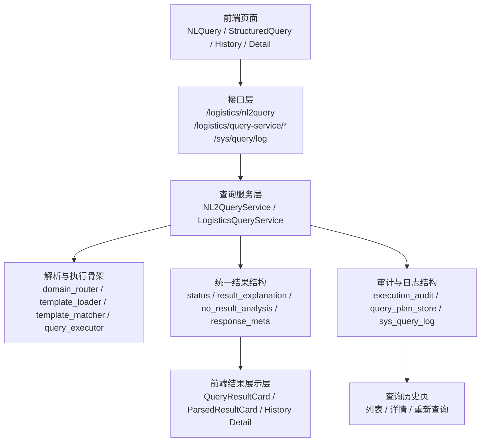

# PLATFORM_M1_1_BASELINE_INVENTORY.md

## 一、文档用途

本文件用于沉淀【里程碑 1 / 子里程碑 1.1：平台共性能力盘点与边界切分】的输出物。

本轮只做：

- 清单
- 映射
- 依赖图
- 第二业务域复用候选

本轮不做：

- 主链路实现重构
- 第二业务域代码接入
- RAG / 工具层 / Agent 实现

---

## 二、平台共性能力矩阵

### 1. 当前判断原则

这里的“平台共性能力”指的是：

- 不依赖 logistics 业务口径本身
- 理论上可以被第二业务域直接复用，或以较小代价抽成通用组件
- 对后续多域接入、日志追踪、回放、审计有共同价值

### 2. 能力矩阵

| 能力项 | 当前主要落点 | 当前状态 | 复用判断 | 当前绑定程度 | 说明 |
| --- | --- | --- | --- | --- | --- |
| FastAPI 应用骨架 | `backend/app/main.py`、`backend/app/api/router.py` | 已完成 | 可直接复用 | 低 | 应用启动、统一路由、中间件注册已具备平台底座属性 |
| 统一响应包装 | `backend/app/core/response.py`、`backend/app/schemas/common.py` | 已部分完成 | 可直接复用 | 中 | 外层 `ApiResponse/ResponseEnvelope` 已统一，但内部 `data` 结构仍明显依赖 logistics |
| Trace / Request ID 中间件 | `backend/app/main.py`、`backend/app/core/middleware.py`、`backend/app/middleware/request_context.py` | 已完成 | 可直接复用 | 低 | 这部分已经是平台基础设施 |
| 配置管理 | `backend/app/core/config.py` | 已部分完成 | 可复用但需收口 | 中 | 配置入口统一，但字段名仍偏物流与当前本地环境 |
| 查询历史列表与详情 | `backend/app/services/query_log_service.py`、`backend/app/api/v1/system.py` | 已完成 | 可直接复用 | 中 | 日志表和展示结构可复用，但字段内容目前主要服务 logistics |
| 查询计划落库 | `backend/app/domains/logistics/services/query_plan_store.py` | 已部分完成 | 可复用但需抽象 | 高 | 复用的是落库思路，不是当前类名和字段形态 |
| 状态标准化 | `backend/app/domains/logistics/services/query_response_standardizer.py` | 已部分完成 | 可复用但需抽象 | 高 | 当前逻辑通用，但类名、错误码和业务语义仍是 logistics 专属 |
| 结果数量统一判定 | `backend/app/domains/logistics/services/result_count_helper.py` | 已部分完成 | 可复用但需抽象 | 中 | 统计思路通用，但当前对 aggregate/detail/compare 的判断是物流查询形态驱动 |
| 配置化模板加载 | `backend/app/domains/logistics/services/template_loader.py` | 已部分完成 | 可直接作为多域骨架复用 | 中 | 已支持多域目录，但模板语义仍主要围绕 logistics |
| 域关键词路由 | `backend/app/domains/logistics/services/domain_router.py` | 已部分完成 | 可复用但需去物流兜底 | 高 | 已支持多域关键词，但默认强回退 logistics |
| 模板匹配 / 评分 / 冲突消解 | `template_matcher.py`、`template_scorer.py`、`conflict_resolver.py` | 已部分完成 | 可复用但需验证 | 中 | 算法框架有平台化价值，但只在 logistics 上经过实战验证 |
| 参数校验 / SQL 白名单 / SQL 渲染 | `query_param_validator.py`、`sql_whitelist.py`、`sql_renderer.py` | 已部分完成 | 可复用但需域适配 | 中 | 安全治理方向通用，但模板 ID、字段约束、预览方式仍偏 logistics |
| 前端查询页骨架 | `frontend/src/router/index.ts`、`layouts/`、`views/` | 已部分完成 | 可复用但需克制复用 | 中 | 查询页、历史页、明细页的页面模型可复用，但当前字段展示明显是物流语义 |
| 查询上下文保留 | `frontend/src/utils/queryStorage.ts` | 已完成 | 可直接复用 | 低 | 当前实现是轻量页面级能力，平台复用成本低 |
| 联调回归清单 | `docs/FRONTEND_V2_1_REGRESSION_CHECKLIST.md` | 已完成 | 可直接复用方法论 | 低 | 场景内容仍是 logistics，但方法和模板是平台资产 |

### 3. 当前最值得优先抽象的平台基线

基于上面的矩阵，里程碑 1 最值得优先抽象的平台基线有 4 类：

1. 统一响应结构与状态结构
2. 查询历史 / 回放 / 审计结构
3. 多域模板加载、域注册与路由骨架
4. 第二业务域接入最小清单

原因：

- 这 4 类能力最直接影响“第二业务域能不能接”
- 它们比 RAG、工具层、Agent 更贴近当前真实主链路
- 它们已经在 logistics 上有真实样板，不是空想设计

---

## 三、logistics 域特有能力清单

以下能力当前仍明显属于 logistics 域特有，不能直接当作平台共性：

### 1. 物流业务口径与指标解析

- `shipment_watt` 作为默认“运量”口径
- 物流公司 / 承运商 / 区域 / 运输方式等物流专属维度
- 历史 Excel 与 2026+ 系统数据混合规则
- 仓库维度暂不可靠的业务边界

### 2. 物流专属模板与 SQL 模板

- `logistics.monthly_metric_total`
- `logistics.monthly_compare`
- `logistics.carrier_month_rank`
- `logistics.detail_by_business_no`

这些模板的存在可以被复用为“机制”，但模板内容本身不能复用到第二业务域。

### 3. 物流专属解析规则

- 合同编号 / SAP 单号 / 发货指令 / 询比价编号等业务编号识别
- 铁运 / 公路 / 水运等枚举语义归一
- 物流域 fallback 兼容逻辑
- 业务编号探测（`business_no_probe`）

### 4. 物流专属前端展示语义

- 指标口径标签
- 物流维度中文列名
- 明细页中的物流记录字段
- 历史页中的物流查询标题与说明

### 5. 结论

当前平台主线最重要的工作，不是把这些物流特有能力“伪装成平台能力”，而是：

- 明确哪些是物流特有
- 明确哪些可以抽成平台骨架
- 让第二业务域接入时，只替换域特有部分，而不是复制整套物流实现

---

## 四、当前字段 / 状态 / 日志结构依赖图

### 1. 依赖图说明

下面的图不是类图，而是当前真实主链路中的“结构依赖图”，重点说明：

- 前端依赖哪些统一字段
- 后端哪些服务生成这些字段
- 查询历史如何复用这些结构

### 2. 结构依赖图

### 3. 当前关键结构依赖

#### 前端当前直接依赖的统一字段

- `question`
- `parsed`
- `query_result`
- `response_meta`
- `query_result.status`
- `query_result.result_explanation`
- `query_result.no_result_analysis`
- `execution_mode`
- 历史页中的 `status_code / execution_mode / template_hit / parsed / query_result / response_meta`

#### 后端当前负责生成这些字段的核心位置

- `LogisticsNL2QueryService`
  - 组织 `question / parsed / query_result / response_meta`
- `LogisticsQueryResponseStandardizer`
  - 生成 `status / response_meta`
- `LogisticsResultExplainer`
  - 生成 `result_explanation`
- `LogisticsNoResultAnalyzer`
  - 生成 `no_result_analysis`
- `LogisticsQueryPlanStore`
  - 把 `parsed / execution_binding / execution_summary / response_meta / query_result` 落到历史日志
- `QueryLogService`
  - 把日志结构再次归一为前端可直接消费的历史详情结构

### 4. 当前最需要在 1.2 继续收口的结构依赖

1. `response_meta` 与 `query_result.status` 的平台通用化边界  
2. 查询历史详情里的 `parsed / query_result / response_meta` 是否应提升为平台统一日志结构  
3. `execution_audit / execution_summary / execution_binding` 的平台最小保留字段  
4. 第二业务域是否必须沿用当前 `question / parsed / query_result / response_meta` 四段结构

---

## 五、第二业务域复用候选清单

### 1. 可直接复用的候选

这些能力建议第二业务域直接复用，不应重新造一套：

- FastAPI 应用骨架与统一路由挂载方式
- Trace / Request ID / 中间件
- 外层统一响应包装
- 查询历史列表与详情接口模式
- 查询上下文保留机制
- 联调回归清单模板

### 2. 可复用但需要轻量抽象的候选

这些能力适合在里程碑 1.2 收口成平台基线后，再给第二业务域复用：

- 统一状态结构与错误码结构
- `response_meta` 最小字段集合
- 查询计划落库结构
- 域注册信息
- 模板加载与域路由框架
- 模板匹配 / 评分 / 冲突消解
- 参数校验与白名单治理思路

### 3. 只能复用机制、不能直接复用内容的候选

这些能力的“机制”可复用，但“内容”必须换成新业务域自己的内容：

- 模板 YAML
- SQL 模板
- 指标字典
- 同义词词典
- 枚举映射
- 业务编号探测规则

### 4. 暂不建议在第二业务域复用的部分

这些部分当前仍明显绑定 logistics，不建议原样复用：

- fallback 兼容数据模型
- 物流业务字段中文映射
- 物流前端结果摘要话术
- 物流明细页字段展示结构
- 物流域聊天式接口的答复文案

### 5. 当前对第二业务域最关键的复用结论

若下一业务域按计划 BOM 启动，最应优先复用的是：

1. 多域模板加载与域路由骨架
2. 统一响应 / 状态 / 日志 / 回放结构
3. 查询历史与回归清单方法论

最不应直接复制的是：

1. 物流模板内容
2. 物流指标语义
3. 物流前端字段展示语义

---

## 六、本轮结论

### 1. 当前平台最核心的现实判断

当前项目不是“已经完成平台化”，而是：

- **已经有一个成熟样板域：logistics**
- **已经有若干平台骨架：路由、模板分层、日志、状态、回放**
- **但这些骨架尚未被第二业务域验证**

### 2. 子里程碑 1.1 的产出结论

本轮盘点得出的直接结论是：

1. 现在可以进入 1.2，去定义平台契约基线与域接入规范；
2. 但 1.2 不应脱离 logistics 当前真实结构做抽象；
3. 第二业务域接入前，最先要抽的是“结构”和“规范”，不是“业务模板内容”。

### 3. 当前仍未解决的问题

- compare / fallback 中还有哪些问题会阻塞平台抽象，尚未在本轮展开
- 第二业务域的真实输入条件是否到位，尚未在本轮确认
- 平台共性能力是否需要拆成独立目录，当前仍未到做目录级重构的时机
